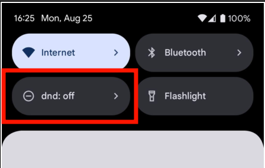
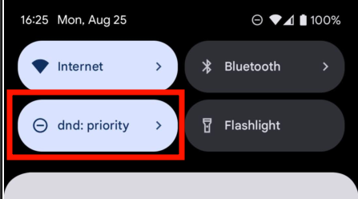
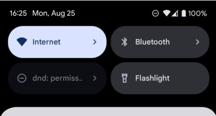
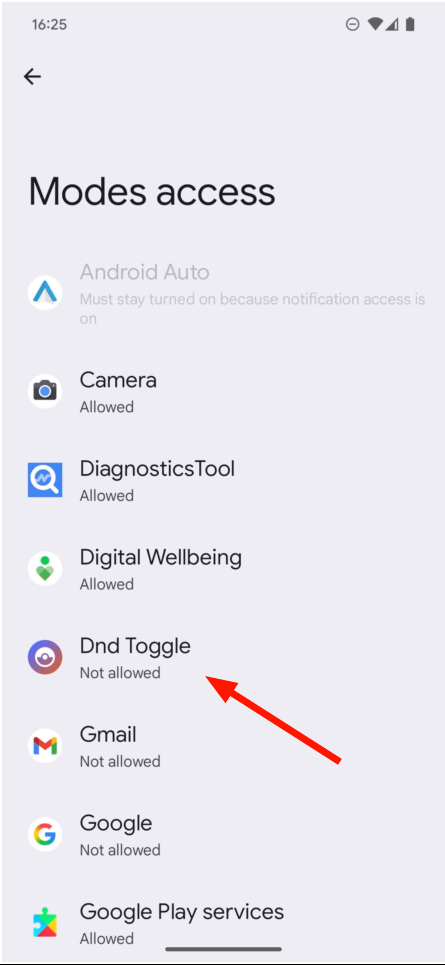
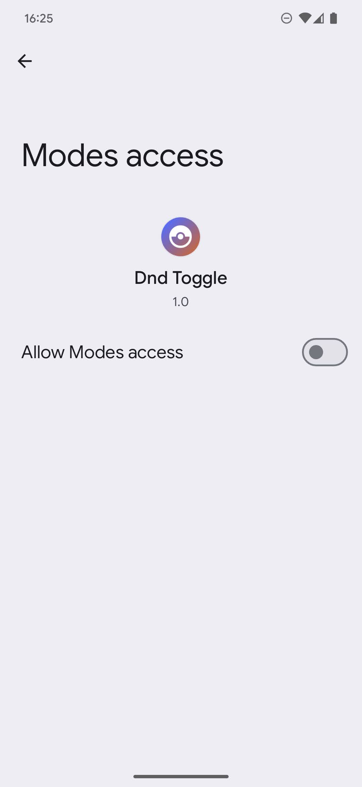
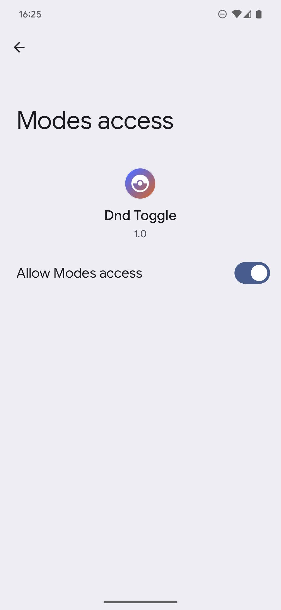

# DND Toggle

Adds a "Quick Settings Tile" that toggles Do Not Disturb.

Created because an Android version upgrade made it 2 clicks to toggle DND (since they have several modes now).  
Vibe-coded with Gemini, written with Kotlin.  

## Usage
Install APK as usual.  
Add the new Quick Settings tile to your tile collection.  

When DND is off, the tile is "inactive":  
  
Clicking it will turn DND on to "priority" mode.  

When DND is on, the tile is "active":  
  
Clicking it will turn DND off.  

## Permissions
Apps usually can't access DND. If the app doesn't have access, it'll be "grayed out".  
  
To allow this app to access it, long click on the tile to access the app screen.  
Then click the button to go to system settings  
  
There, select our app  
  
DND access will be off  
  
Set it to on  
  
The app should now work

## Contributing
PRs and issues welcome

## Development

### Bumping Versions
When releasing a new version, update the following files:
1. `app/build.gradle.kts` - Update `versionCode` and `versionName` in the `defaultConfig` section
2. `README.md` - Add a new version entry in the Changelog section
3. `metadata/en-US/changelogs/` - Add a new file named with `${versionCode}.txt` with changes
